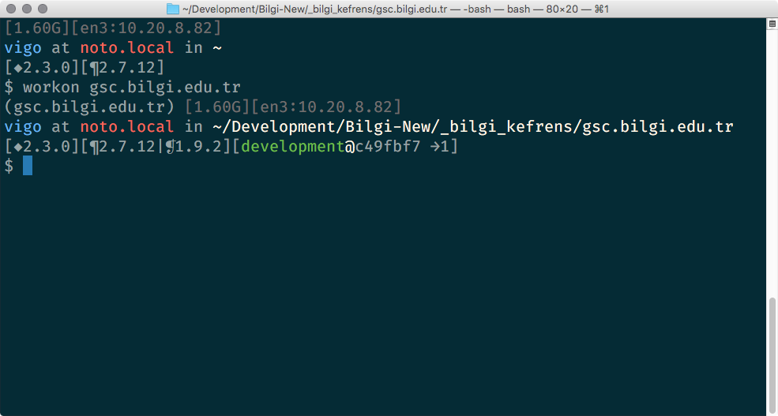

# Dotfiles Final Whistle

## UPDATE
https://github.com/vigo/dotfiles-fever is the new rising ☆

---

OS X, Ubuntu and Gentoo Linux competible dot-files / shell environment
collection.

## Requirements
### OSX

You need [Homebrew][brew] and `git`. Install [Homebrew][brew] first and then
install `git` via `brew install git`.

### Ubuntu

`git` required. `sudo aptitude install git` can help you out...

### Gentoo

`git` required :) `emerge dev-vcs/git`

## Installation and Removal

You need to clone the repo:

    git clone https://github.com/vigo/dotfiles-universal.git $HOME/Dotfiles
    bash $HOME/Dotfiles/scripts/install.sh

`nanorc` is optional now. Please check `rc/nanorc.example` for more information.

Dotfiles is shiped with configurable `PS1` feature. PS1 elements are:

    ps1_Horizontal_Line
    ps1_Shell_Name
    ps1_Free_Memory
    ps1_Battery_Status
    ps1_IP_List
    ps1_Username_and_Hostname
    ps1_Database_Status
    ps1_Virtualenv_Status
    ps1_RBENV_Status
    ps1_PYENV_Status
    ps1_GIT_Status
    ps1_Mercurial_Status

There are two pre-defined configurations:

        ps1_PREFS_Full
        ps1_PREFS_Basic

Default value for `PS1` is `ps1_PREFS_Basic`:

```bash
# you’ll see this:
export PS1=$ps1_PREFS_Basic
```

You can override this via putting your own config under `Private/` folder as `ps1`:

```bash
# example custom PS1
export PS1=$ps1_PREFS_Full

# or
export PS1="${ps1_Username_and_Hostname}\n$ "

# or
export PS1="$ps1_Username_and_Hostname
$ps1_RBENV_Status$ps1_GIT_Status
> "
```

If you like to uninstall;

    cd $HOME/Dotfiles
    bash scripts/uninstall.sh

### OSX Special

If you like to tweak Yosemite, try:

    bash $HOME/Dotfiles/scripts/tweaks_osx.sh

Need to restart shell / logout - login or `exec $SHELL`.

## Goodies

* Fancy `history`
* Color-full files :)
* `.inputrc` magic!
* OSX specific aliases: `desktop_hide`, `desktop_show`, `shadow_screenshot_disable`,
`shadow_screenshot_enable`, `ios_backup_disable`, `ios_backup_enable`,
`ds_store_clear`, `reload_textmate`
* try `alias` to see additions. `what_is_my_real_ip`, `what_is_my_public_ip`

Put all of your **private** stuff under `Private/` folder! Custom functions,
env, aliases etc...

## Functions and Aliases

### Functions

- `webserver` : SimpleHTTPServer.
- `webserver_rb` : Ruby version of simple http server uses `httpd` of ruby!
- `gz_analyse` : Shows not/gzipped size diffs
- `dataurl` : Creates base64 encoded image!
- `mkdir_cd`: Creates folder and cd’ies in to it!

### Aliases

- `ll`, `la`, `l` : Listing directory, you know the drill!
- `grep`, `fgrep` : Incase sensitive and color enabled.
- `less`, `more` : Enabled raw control characters.
- `rm` : By default : `rm -i`
- `what_is_my_public_ip`, `what_is_my_real_ip` : Use `what_is_my_public_ip` if `dig` installed.
- `restart_bash` : Reload bash environment

## Prompt Shell Features

**OSX**: Free Memory, Battery status, IP List, Database (MySQL + PostgresQL) Status

**BOTH**: Rbenv, Pyenv, Git / Mercurial prompt, Virtualenv

## Screenshots



## Change Log

You can browse [change log here](CHANGELOG.md).

## Contributer(s)

* [Uğur "vigo" Özyılmazel][01] - Creator, maintainer

## License

This project is licensed under MIT.


[01]: https://github.com/vigo
[brew]: http://brew.sh
